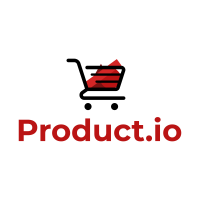

[![LinkedIn][linkedin-shield]][linkedin-url]

<br />
<p align="center">
  <a href="https://github.com/shakkky/product-listing-platform">
    
  </a>

  <h3 align="center">Product.io Platform</h3>

  <p align="center">
    Shakeel Mohammed - Code Challenge
    <br />
    <a href="https://github.com/shakkky/product-listing-platform"><strong>Explore the docs »</strong></a>
    <br />
  </p>
</p>


<!-- TABLE OF CONTENTS -->
<details open="open">
  <summary>Table of Contents</summary>
  <ol>
    <li>
      <a href="#about-the-project">About The Project</a>
      <ul>
        <li><a href="#built-with">Built With</a></li>
      </ul>
    </li>
    <li>
      <a href="#getting-started">Getting Started</a>
      <ul>
        <li><a href="#prerequisites">Prerequisites</a></li>
        <li><a href="#installation">Installation</a></li>
      </ul>
    </li>
    <li><a href="#usage">Usage</a></li>
    <li><a href="#roadmap">Roadmap</a></li>
    <li><a href="#contact">Contact</a></li>
    <li><a href="#acknowledgements">Acknowledgements</a></li>
  </ol>
</details>

## About The Project

![Product Name Screen Shot][product-screenshot]

This a simply product listing platform for fictional business - Product.io.

The user flow of the module is as follows:
* A user is presented with a product page and is ready to start browsing. 
* Once the user opens the page, the page must send a request to the backend to retrieve all products and display them on the page.
* The backend service takes the request and services it.
* The user is able to paginate the entire collection (items per page).
* The user is able to cycle through the pages to browse the rest of the items.

### Built With

The application has been built to be run locally in Docker containers, and as services in AWS Lambda and S3.
* [React.js](https://reactjs.org)
* [Express.js](https://expressjs.com)
* [Docker](https://www.docker.com)
* [LocalStack](https://localstack.cloud)

### Design Diagram
![Design Diagram][design-diagram]

## Getting Started

To get a local copy up and running follow these simple steps.

### Prerequisites, Installation & Setup

This is an example of how to list things you need to use the software and how to install them:
- Ensure Docker is installed on local machine:
    ```sh
    docker version
    ```
    If Docker is not installed, follow [these](https://docs.docker.com/get-docker) steps.

- Clone the repo
    ```sh
    git clone https://github.com/shakkky/product-listing-platform.git
    ```

## Usage
The application can be run locally, and the backend has been built to allow for deployment to AWS in the future as the serivce handlers can be used as Lambda handlers. When running locally, a docker container running LocalStack is spun up and used by REST service rather than AWS hosted services to allow for localized development and testing.

Running Locally:
1. Build docker containers using docker-compose build:
    ```sh
    docker-compose build
    ```
2. Start docker containers using docker-compose up:
    ```sh
    docker-compose up
    ```
3. The application is now running on your local machine. Navigate to react frontend hosted in Docker container: http://localhost:3000

Note, here are a few commands that are useful for viewing DynamoDB table running in LocalStack:
* Scan "products" table:
    ```sh
    aws --region=ap-southeast-2 --endpoint-url=http://localhost:4566 dynamodb scan --table-name=products
    ```
* Delete "products" table:
    ```sh
    aws --region=ap-southeast-2 --endpoint-url=http://localhost:4566 dynamodb delete-table --table-name=products
    ```

### Jest Tests
Jest Tests are run automatically and must pass during the build phase.
Passed tests:
  ```
  PASS  src/__tests__/pagination.test.js
  PASS  src/__tests__/products.test.js

  Test Suites: 2 passed, 2 total
  Tests:       6 passed, 6 total
  Snapshots:   0 total
  Time:        1.621 s, estimated 2 s
  Ran all test suites.
  ```

## Roadmap
There are a few improvements I would like to make:
* Local environment setup optimization - Currently, when the service has just been spun up for the first time on a computer, the DB takes a few seconds to populate (due to the number of records, we see connection pool warnings from localstack). Due to this wait time, the REST service returns a sub-set of product items. I would like to optimize this mechanism.
* Implement a pipeline for deployment to AWS. I have achieve this in the past using Serverless framework to deploy a react app to an S3 CDN, Lambda REST service, and DynamoDB persistence layer. See here: https://github.com/shakkky/gym-time-platform
* Use supertest to simluate HTTP requests during testing to run more service-level/functional tests.
* Use Jest or Selenium to implement functional testing of the front end.
* Implement pagination in the REST layer. The records are currently returned as one chunk. This has the potential to cause latency, whuch I consider as an important issue.

## License
Distributed under the MIT License. See `LICENSE` for more information.

## Contact
Shakeel Mohammed - [LinkedIn](https://www.linkedin.com/in/shakeel-mohammed-5b046a183/) - shakeel.mohammed1@hotmail.com
Project Link: [https://github.com/shakkky/product-listing-platform](https://github.com/shakkky/product-listing-platform)

## Acknowledgements
* [React Bootstrap](https://react-bootstrap.github.io)


[linkedin-shield]: https://img.shields.io/badge/-LinkedIn-black.svg?style=for-the-badge&logo=linkedin&colorB=555
[linkedin-url]: https://www.linkedin.com/in/shakeel-mohammed-5b046a183/
[product-screenshot]: images/screenshot.jpg
[design-diagram]: images/design-diagram.jpg